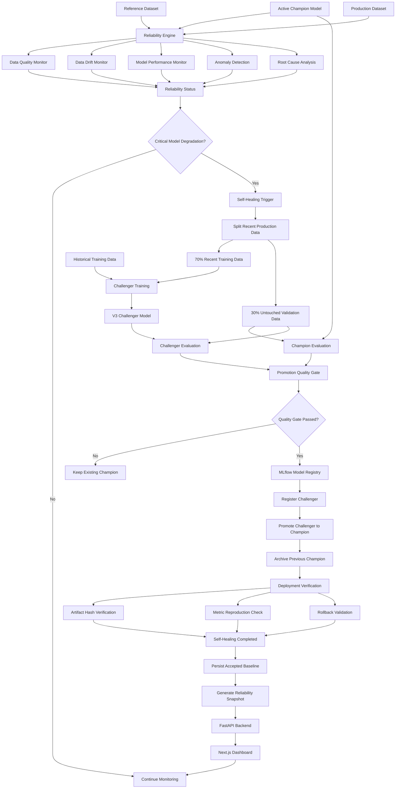
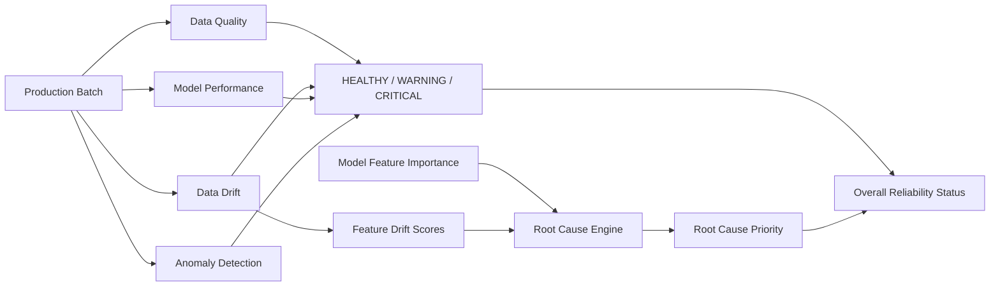
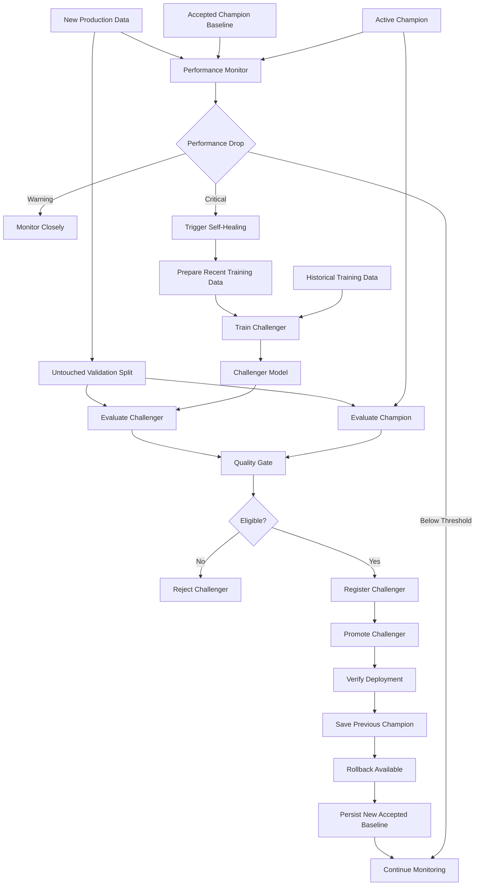
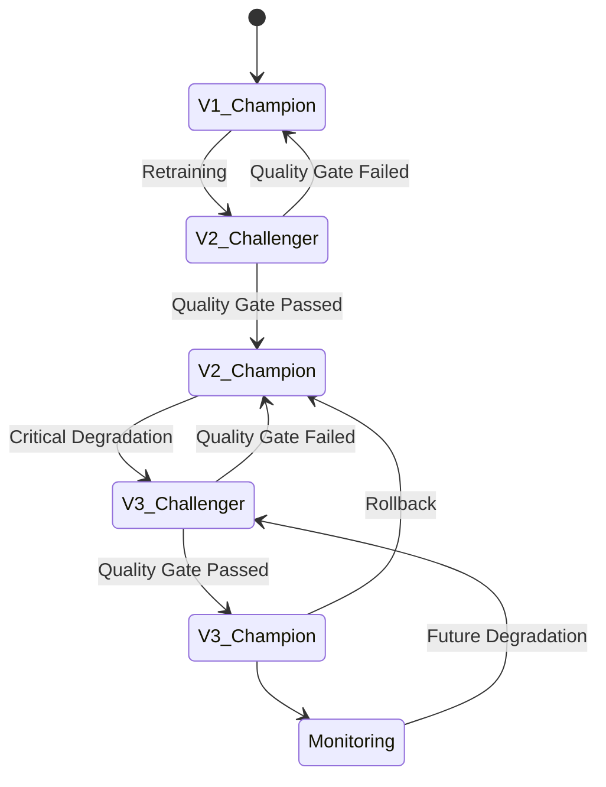
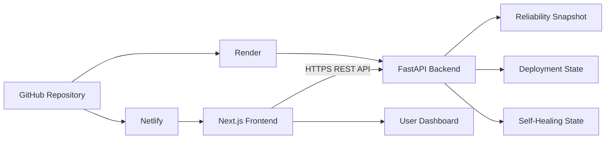

# Enterprise AI Reliability Platform — System Architecture

## High-Level Architecture



---

# Reliability Monitoring Architecture

The platform monitors multiple dimensions independently.



The overall system status is determined from the individual monitoring subsystems.

A model can therefore be healthy while the overall AI system remains critical.

For example:

```text
Data Quality        HEALTHY
Data Drift          CRITICAL
Model Performance   HEALTHY
Anomaly Detection   HEALTHY

Overall Reliability CRITICAL
```

This prevents successful model retraining from hiding unresolved production-data problems.

---

# Self-Healing Architecture



---

# Promotion Quality Gate

The challenger must pass all predefined conditions.

```text
F1 improvement        >= 0.05
Recall improvement    >= 0.00
Precision drop        <= 0.02
```

The gate is evaluated using the same untouched validation dataset for both models.

This ensures that the champion and challenger are compared fairly.

---

# Model Lifecycle



---

# Current Demonstration Lifecycle

The completed demonstration followed this model lifecycle:

```text
V1
 ↓
Initial Champion

V2
 ↓
First promoted challenger
 ↓
Accepted V2 baseline persisted

Batch 2 arrives
 ↓
Critical F1 + Recall degradation detected
 ↓
V3 challenger trained
 ↓
V2 and V3 tested on same untouched validation set
 ↓
V3 passes quality gate
 ↓
V3 registered
 ↓
V3 promoted
 ↓
V2 archived
 ↓
Deployment verified
 ↓
V3 accepted baseline persisted
 ↓
Rollback to V2 remains available
```

---

# Backend Architecture

```mermaid
flowchart LR

    A[Next.js Frontend]

    A --> B[FastAPI]

    B --> C[/api/reliability]
    B --> D[/api/performance]
    B --> E[/api/drift]
    B --> F[/api/anomalies]
    B --> G[/api/root-causes]
    B --> H[/api/deployment]
    B --> I[/api/self-healing]

    C --> J[reliability_snapshot.json]

    H --> K[deployment_state.json]

    I --> L[self_healing_state.json]

    D --> M[Performance Monitor]
    E --> N[Drift Monitor]
    F --> O[Anomaly Detector]
    G --> P[Root Cause Service]
```

---

# Production Deployment Architecture



---

# Reliability Snapshot Architecture

Running all ML monitoring calculations on every API request would be expensive.

The platform therefore uses:

```text
ML Computation
      ↓
Reliability Report
      ↓
JSON Snapshot
      ↓
FastAPI
      ↓
Dashboard
```

The snapshot is generated using:

```powershell
python -m scripts.generate_reliability_snapshot
```

and stored as:

```text
models/reliability_snapshot.json
```

This allows the deployed backend to serve monitoring results without repeatedly loading heavy ML components.

---

# Main Components

| Component | Responsibility |
|---|---|
| Data Quality Monitor | Detect schema and data-quality problems |
| Drift Monitor | Detect numerical and categorical distribution changes |
| Performance Monitor | Evaluate champion model metrics |
| Anomaly Detector | Detect unusual production transactions |
| Root Cause Service | Prioritize drifted and influential features |
| Healing Trigger | Decide when automatic recovery is required |
| Challenger Trainer | Retrain using historical and recent data |
| Quality Gate | Decide whether challenger can be promoted |
| MLflow Registry | Maintain model version lineage |
| Promotion Service | Replace active champion |
| Verification Service | Validate promoted artifact and metrics |
| Baseline Service | Persist accepted champion performance |
| Snapshot Service | Serve lightweight monitoring results |
| FastAPI | Provide reliability APIs |
| Next.js | Present the reliability dashboard |

---

# Design Principle

The architecture intentionally separates:

```text
Data Reliability
Model Reliability
Operational Reliability
Recovery State
```

A successful self-healing event does not automatically mean the complete AI system is healthy.

This separation allows the system to report situations such as:

```text
Model recovered successfully
BUT
production data continues to drift
```

which is the current demonstrated system state.